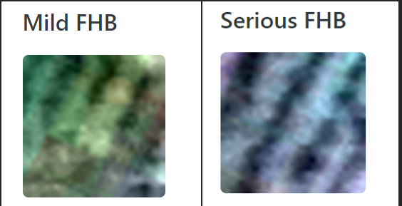

# FHBDetectionUsingCNN
Using a Convolutional Neural Network to detect FHB on crops taken by Hyperspectral Imagery

# Model was created in PyTorch.
# Data was given by Kaggle. 
The data were pytorch tensors, so a custom LoadDataset() class was written to create a dataset from the pytorch tensors to train the model.

# Model Predictions & Training Evaluation

## The model scored 1.0 on the Kaggle evaluation. Which is 100%
